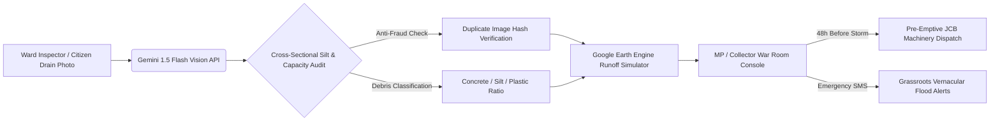

# 🌊 NadiRakshak AI (नदी रक्षक)
> **Pre-Monsoon Drainage Choke & Flood Inundation Proof-of-Work Auditor**  
> *Built for "Code for Communities 2.0" (Google Cloud & GDG India) — Clean Air & Climate Resilience Track*

[](https://cloud.google.com/)
[](https://ai.google.dev/)
[](https://earthengine.google.com/)
[](https://opensource.org/licenses/MIT)

---

## 📌 Problem Statement: The Multi-Crore Drainage Blindspot
Every monsoon, Indian cities drown in severe urban flash floods, causing immense economic disruption, property destruction, and subsequent outbreaks of vector-borne epidemics (Dengue, Malaria, Cholera).

### The Critical Governance Gap:
1. **Unverified Desilting Contracts**: Municipalities spend ₹500+ Crore annually on drain desilting tenders. Contractors often clean only superficial entrance debris or submit fraudulent bills, leaving subterranean culverts completely choked.
2. **Subterranean Silt & Concrete Slag**: Below-grade silt and construction waste accumulate unseen, choking 70–90% of drainage discharge capacity before the first monsoon shower.
3. **Purely Reactive Disaster Response**: Machinery and pumps are deployed only after neighborhoods are submerged and distress calls flood emergency helplines.

---

## 💡 The Solution: NadiRakshak AI
NadiRakshak AI transforms urban drainage from an unverified corruption-prone blindspot into a transparent, AI-audited climate defense system:



---

## 🌟 Core Modules

### 1. 👁️ Zero-Hardware Silt & Choke Vision (Gemini 1.5 Flash)
- Staff and citizens snap photos of drains on basic smartphones.
- Gemini 1.5 evaluates **cross-sectional hydraulic clearance**, calculates silt accumulation percentage (0–100%), and classifies debris composition (concrete slurry vs. solid plastic) in <400ms.

### 2. 🛡️ Anti-Fraud Proof-of-Desilting
- Compares before-and-after contractor submissions using visual embeddings to detect reused duplicate photos, altered lighting angles, and fraudulent billing claims.

### 3. 🌧️ 48-Hour Pre-Rain Inundation Forecast
- Couples IMD meteorological radar precipitation data with Google Earth Engine digital elevation models to predict which residential colonies will suffer backflow 48 hours before downpours occur.

### 4. 🚜 MP / District Magistrate War Room
- Generates an executive priority queue for municipal authorities, automatically dispatching backhoes (JCBs) and suction tankers to critical bottlenecks.

---

## 🛠️ Google Technologies Used
| Component | Technology | Role |
|---|---|---|
| **AI Vision Engine** | Gemini 1.5 Flash (Vertex AI) | Hydraulic silt ratio calculation & photo fraud detection |
| **Spatial Hydrology** | Google Earth Engine | Digital elevation models & watershed surface runoff modeling |
| **Serverless Backend** | Google Cloud Run | High-throughput microservices for audit ingestion & billing verification |
| **Mapping & Routing** | Google Maps Platform | Culvert choke clustering & municipal GPS machine routing |
| **Alert Infrastructure**| Firebase Cloud Messaging | Zero-latency SMS/push alert distribution |

---

## 🚀 Quickstart & Local Execution

Double-click `index.html` or launch locally via Python:
```bash
python -m http.server 8080
```
Open [http://localhost:8080](http://localhost:8080) to interact with the full live prototype!

---

## 👥 Authors
- **Event**: Build with AI: Code for Communities 2.0 (Google Cloud & GDG India)
- **Author**: Anmol Suwalka & Team (tejasvigautam2007)
